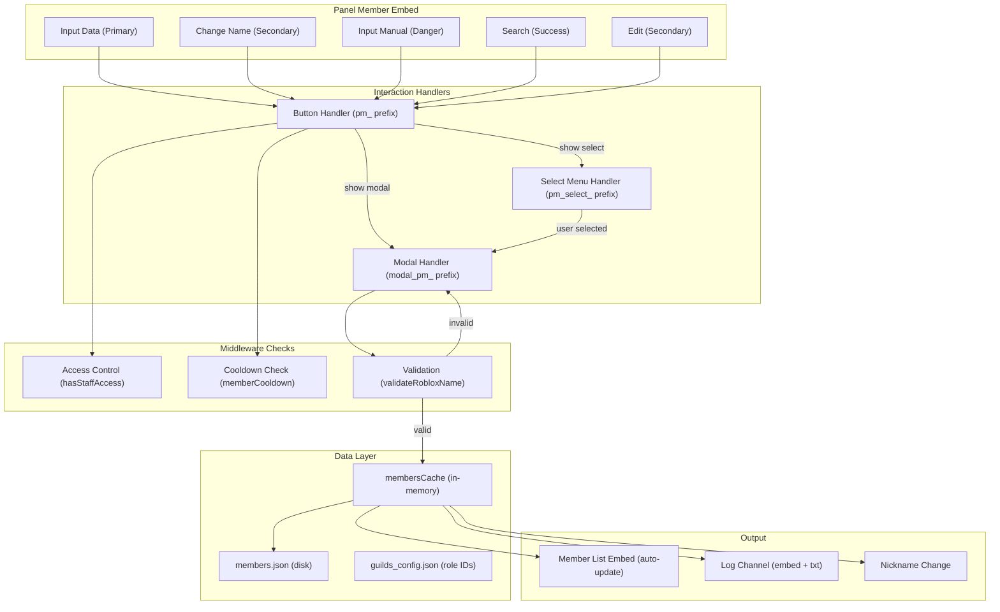
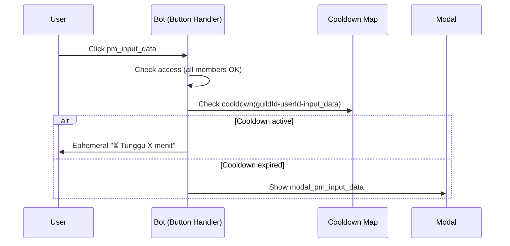
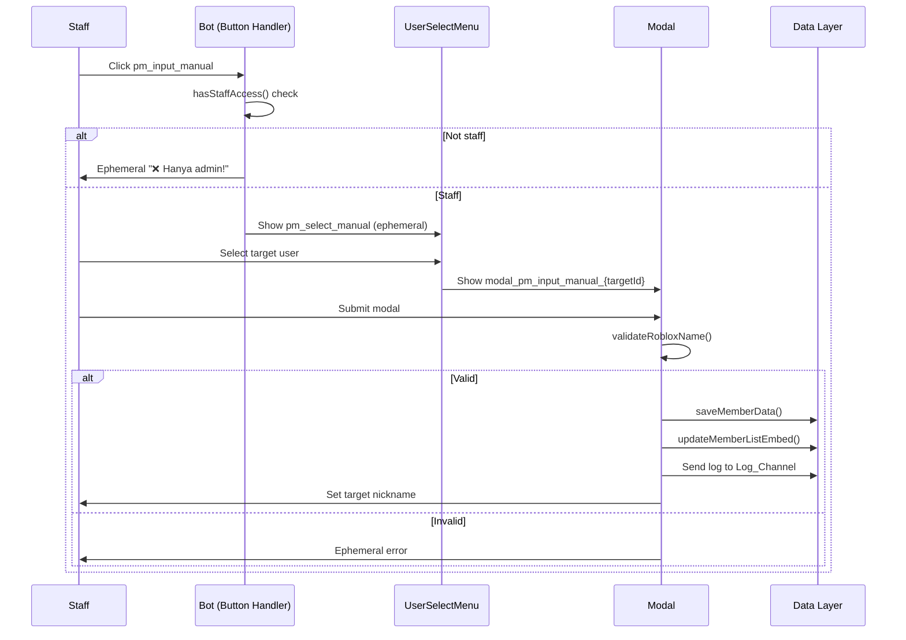

# Design Document: Panel Member System

## Overview

The Panel Member System integrates into the existing FII Discord bot (`index.js`) as a set of button, modal, and select menu interaction handlers. It provides a self-service registration panel where members register their Roblox identity, and staff can manage member data. The system leverages the existing architecture patterns: in-memory caches backed by JSON files, `Map`-based cooldowns, and the established interaction handler chain.

The implementation adds handlers to the existing `Events.InteractionCreate` listeners for buttons (prefixed `pm_`), modals (prefixed `modal_pm_`), and user select menus (prefixed `pm_select_`). Data flows through the existing `membersCache` → `members.json` persistence layer using `getGuildMembers()`, `saveMemberData()`, and `getMemberData()`.

## Architecture



## Components and Interfaces

### 1. Panel Deployment

**Trigger:** Staff uses a command (e.g., message command or slash command) to deploy the panel.

**CustomId:** The panel buttons use the `pm_` prefix:
| Button | customId | Style | Access |
|--------|----------|-------|--------|
| Input Data | `pm_input_data` | Primary | All members |
| Change Name | `pm_change_name` | Secondary | All members |
| Input Manual | `pm_input_manual` | Danger | Staff only |
| Search | `pm_search` | Success | Staff only |
| Edit | `pm_edit` | Secondary | Staff only |

### 2. Modal Definitions

| Modal | customId | Fields | Triggered By |
|-------|----------|--------|--------------|
| Input Data | `modal_pm_input_data` | Nama Roblox, Nama Panggilan, Alamat | `pm_input_data` button |
| Change Name | `modal_pm_change_name` | Nama Roblox | `pm_change_name` button |
| Input Manual | `modal_pm_input_manual_{targetUserId}` | Nama Roblox, Nama Panggilan | `pm_select_manual` select menu |
| Edit | `modal_pm_edit_{targetUserId}` | Nama Roblox | `pm_select_edit` select menu |
| Title Change | `modal_pm_title` | Title | Title change command |

**Note:** For Input Manual and Edit, the target user ID is encoded in the modal customId because Discord modals cannot carry state between the select menu interaction and the modal submission.

### 3. Select Menu Definitions

| Select Menu | customId | Type | Triggered By |
|-------------|----------|------|--------------|
| Manual Target | `pm_select_manual` | UserSelectMenu | `pm_input_manual` button |
| Search Target | `pm_select_search` | UserSelectMenu | `pm_search` button |
| Edit Target | `pm_select_edit` | UserSelectMenu | `pm_edit` button |

### 4. Button Handler Flow



### 5. Staff Button Flow (Input Manual / Search / Edit)



### 6. Existing Helper Functions (No Changes Needed)

The following functions already exist in `index.js` and will be used as-is:

- `getGuildMembers(guildId)` — Returns guild member data structure, initializes if missing
- `saveMemberData(guildId, userId, data)` — Merges data into member record, saves to disk
- `getMemberData(guildId, userId)` — Returns member record or null
- `validateRobloxName(name)` — Returns boolean (currently only checks `endsWith("CHAOS")`)
- `hasStaffAccess(member, guildId)` — Checks if member has any staff role
- `updateMemberListEmbed(guild, guildId)` — Rebuilds and updates the list embed
- `memberCooldown` — Existing Map for cooldown tracking

### 7. Functions to Modify

**`validateRobloxName(name)`** — Must be enhanced to also check:
- Minimum 6 characters total (at least 1 char before "CHAOS")
- Maximum 20 characters
- Not empty/whitespace-only

New signature remains the same but returns an object: `{ valid: boolean, error?: string }`

**`updateMemberListEmbed(guild, guildId)`** — Must be enhanced to:
- Handle 4096-character embed description limit with truncation
- Sort entries by registration time (add `registeredAt` field)

## Data Models

### members.json Structure

```json
{
  "{guildId}": {
    "title": "MEMBER LIST",
    "members": {
      "{userId}": {
        "robloxName": "ExampleCHAOS",
        "nickname": "Example",
        "address": "Jakarta",
        "registeredAt": 1700000000000,
        "updatedAt": 1700000000000
      }
    },
    "listMessageId": "1234567890",
    "listChannelId": "1234567890",
    "panelMessageId": "1234567890",
    "panelChannelId": "1234567890"
  }
}
```

### Cooldown Map Structure

```javascript
// Key format: "{guildId}-{userId}-{actionType}"
// actionType: "input_data" | "change_name"
// Value: timestamp (Date.now()) of last successful submission
memberCooldown.set("guildId-userId-input_data", Date.now());
```

### Cooldown Calculation

```javascript
const COOLDOWN_MS = 60 * 60 * 1000; // 1 hour
const key = `${guildId}-${userId}-${actionType}`;
const lastUsed = memberCooldown.get(key);
const remaining = lastUsed ? COOLDOWN_MS - (Date.now() - lastUsed) : 0;
const isOnCooldown = remaining > 0;
const remainingMinutes = Math.ceil(remaining / 60000); // rounded up, min 1
```

### Log Embed Structure

```javascript
// For "Input Data" registration
const logEmbed = new EmbedBuilder()
  .setColor("#00FF00")
  .setTitle("Log Member")
  .setDescription(`Registered by: ${user}`) // Discord mention
  .addFields(
    { name: "Nama Roblox", value: robloxName, inline: true },
    { name: "Nama Panggilan", value: nickname, inline: true },
    { name: "Alamat", value: address, inline: false }
  )
  .setTimestamp();

// Attached file: log_member.txt
const logContent = `Nama Roblox: ${robloxName}\nNama Panggilan: ${nickname}\nAlamat: ${address}`;
const attachment = new AttachmentBuilder(Buffer.from(logContent), { name: "log_member.txt" });
```

### Log Embed for "Input Manual"

```javascript
const logEmbed = new EmbedBuilder()
  .setColor("#FFA500")
  .setTitle("Log Member")
  .setDescription(`Target: ${targetUser}\nRegistered by: ${staffUser}`)
  .addFields(
    { name: "Nama Roblox", value: robloxName, inline: true },
    { name: "Nama Panggilan", value: nickname, inline: true }
  )
  .setTimestamp();
```

## Correctness Properties

*A property is a characteristic or behavior that should hold true across all valid executions of a system — essentially, a formal statement about what the system should do. Properties serve as the bridge between human-readable specifications and machine-verifiable correctness guarantees.*

### Property 1: Roblox Name Validation

*For any* string input, `validateRobloxName` SHALL return valid=true if and only if the string ends with the exact case-sensitive substring "CHAOS", has a total length between 6 and 20 characters (inclusive), and is not empty or whitespace-only. All other inputs SHALL return valid=false with an appropriate error message.

**Validates: Requirements 10.1, 10.2, 10.3, 10.5**

### Property 2: Member Data Persistence Round-Trip

*For any* valid Roblox name, nickname, and address values, saving member data via `saveMemberData()` and then retrieving it via `getMemberData()` SHALL return an object containing the exact same robloxName, nickname, and address values that were saved.

**Validates: Requirements 2.2, 3.2, 4.3, 6.3**

### Property 3: Member List Formatting

*For any* set of registered members (with valid robloxName and nickname), the generated member list description SHALL contain each member formatted as `**{index}.** {robloxName} [{nickname}]` where index is 1-based, entries are ordered by `registeredAt` timestamp (earliest first), separated by blank lines, and the footer SHALL show `Total: {count} members` where count equals the number of registered members.

**Validates: Requirements 8.1, 8.2, 8.5**

### Property 4: Member List Truncation

*For any* set of registered members where the formatted list description would exceed 4096 characters, the output description SHALL be at most 4096 characters, SHALL end with a line indicating how many members are not shown, and SHALL contain only complete member entries (no partial entries).

**Validates: Requirements 8.7**

### Property 5: Cooldown Enforcement

*For any* user, guild, and action type, if the last successful submission timestamp is within 1 hour of the current time, the cooldown check SHALL reject the interaction and report remaining minutes as `Math.ceil((3600000 - elapsed) / 60000)` with a minimum value of 1. If the timestamp is older than 1 hour or does not exist, the cooldown check SHALL allow the interaction.

**Validates: Requirements 9.1, 9.2, 9.3**

### Property 6: Failed Validation Does Not Trigger Cooldown

*For any* submission that is rejected by `validateRobloxName`, the cooldown map SHALL NOT be updated — the cooldown key for that user/guild/action SHALL retain its previous value (or remain absent if no prior successful submission exists).

**Validates: Requirements 9.4**

### Property 7: Role-Based Access Control

*For any* Discord member and guild configuration, `hasStaffAccess` SHALL return true if and only if the member holds at least one of the configured staff role IDs (ADMIN_ROLE_ID, DEV_ROLE_ID, OWNER_ROLE_ID, STAFF_ROLE_ID, GUARD_ROLE_ID). If no staff role IDs are configured, it SHALL return false for all members.

**Validates: Requirements 11.1, 11.2, 11.4**

### Property 8: Log Entry Completeness

*For any* successful registration (Input Data path), the log embed SHALL contain the registering user's mention in the description, and fields for Nama Roblox, Nama Panggilan, and Alamat. The attached `log_member.txt` SHALL contain labeled lines for each of these three values. For manual registration (Input Manual path), the log embed SHALL contain the target user's mention, the staff user's mention, and fields for Nama Roblox and Nama Panggilan.

**Validates: Requirements 7.1, 7.2, 7.4**

### Property 9: Title Validation and Persistence

*For any* string input, the title validation SHALL accept strings that are between 1 and 50 characters after trimming whitespace, and reject all others. *For any* accepted title, saving it to `members.json` and reloading SHALL preserve the exact title value.

**Validates: Requirements 12.1, 12.2, 12.5**

### Property 10: Search Display Completeness

*For any* registered member with stored data, the search result embed SHALL contain fields showing the member's Nama Roblox, Nama Panggilan, Alamat, and a registration date formatted as "DD/MM/YYYY HH:mm".

**Validates: Requirements 5.2**

## Error Handling

### Strategy

All interaction handlers follow a consistent error handling pattern:

1. **Permission errors (nickname change):** Catch the Discord API error, continue with data save and list update, notify user via ephemeral message that nickname could not be changed.

2. **Missing log channel:** Log warning to console (`console.warn`), continue registration without failing. Never block the primary operation due to logging failure.

3. **Deleted/unreachable list embed:** Detect fetch failure, create a new embed message, store new message ID in Guild_Data.

4. **Interaction timeout (select menus):** Use `awaitMessageComponent` with 60-second timeout. On timeout, catch the error and take no action (the ephemeral message auto-dismisses).

5. **Validation failures:** Return ephemeral error immediately. Do NOT update cooldown. Do NOT modify any data.

6. **General errors:** Wrap each handler in try/catch. If interaction not yet replied/deferred, reply with generic ephemeral error. If already deferred, editReply with error. Always log to console.

### Error Response Pattern

```javascript
try {
  // handler logic
} catch (err) {
  console.error(`[PanelMember] Error in ${handlerName}:`, err);
  const reply = interaction.replied || interaction.deferred
    ? interaction.editReply.bind(interaction)
    : interaction.reply.bind(interaction);
  await reply({ content: "❌ Terjadi kesalahan.", flags: 64 }).catch(() => {});
}
```

### Nickname Permission Handling

```javascript
try {
  await targetMember.setNickname(robloxName);
} catch (nickErr) {
  // Continue with save + list update + log
  nicknameFailed = true;
}
// After all operations:
if (nicknameFailed) {
  replyContent += "\n⚠️ Nickname tidak bisa diubah (bot tidak punya izin).";
}
```

## Testing Strategy

### Unit Tests (Example-Based)

Unit tests cover specific scenarios and edge cases:

- Panel deployment creates correct embed with 5 buttons
- Each button click shows the correct modal/select menu
- Non-staff clicking restricted buttons gets "❌ Hanya admin!"
- Unregistered member clicking "Change Name" gets registration-required error
- Empty member list shows "*Belum ada member terdaftar.*"
- Select menu timeout (60s) is handled gracefully
- Nickname permission failure doesn't block data save

### Property-Based Tests

Property-based tests use a library like [fast-check](https://github.com/dubzzz/fast-check) to verify universal properties across generated inputs. Each property test runs a minimum of 100 iterations.

| Property | Test Focus | Generator Strategy |
|----------|-----------|-------------------|
| Property 1 | Roblox name validation | Random strings (ASCII + unicode), strings ending/not ending with "CHAOS", various lengths |
| Property 2 | Data persistence round-trip | Random valid names, nicknames, addresses |
| Property 3 | Member list formatting | Random sets of 0-100 members with random names/nicknames |
| Property 4 | List truncation | Large member sets (100-500 members) with long names |
| Property 5 | Cooldown enforcement | Random timestamps within and outside cooldown window |
| Property 6 | Validation doesn't trigger cooldown | Random invalid names |
| Property 7 | Access control | Random role sets, random configured role IDs |
| Property 8 | Log completeness | Random registration data |
| Property 9 | Title validation + persistence | Random strings of various lengths |
| Property 10 | Search display | Random member data with timestamps |

**Configuration:**
- Library: `fast-check` (npm package)
- Minimum iterations: 100 per property
- Tag format: `Feature: panel-member-system, Property {N}: {title}`

### Integration Tests

Integration tests verify the full interaction flow with mocked Discord.js objects:

- Full "Input Data" flow: button → modal → save → list update → log
- Full "Input Manual" flow: button → select → modal → save → list update → log
- Cooldown persists across multiple interactions
- Panel redeployment replaces old panel

## Setup Wizard Integration: Clan Member Category

### Category Definition

The Clan Member category is added to the existing `SETUP_CATEGORIES` constant:

```javascript
const SETUP_CATEGORIES = {
  // ... existing categories ...
  clan: {
    name: "📋 Clan Member",
    description: "Panel member, list member, dan log member",
    channels: [
      { key: "MEMBER_PANEL_CHANNEL_ID", name: "⬩➤┃📁┃ㆍ𝙋𝙖𝙣𝙚𝙡-𝙈𝙚𝙢𝙗𝙚𝙧", type: ChannelType.GuildText },
      { key: "MEMBER_LIST_CHANNEL_ID", name: "⬩➤┃📜┃ㆍ𝙇𝙞𝙨𝙩-𝙈𝙚𝙢𝙗𝙚𝙧", type: ChannelType.GuildText },
      { key: "MEMBER_LOG_CHANNEL_ID", name: "⬩➤┃📋┃ㆍ𝙇𝙤𝙜-𝙈𝙚𝙢𝙗𝙚𝙧", type: ChannelType.GuildText }
    ],
    categoryKey: "MEMBER_CATEGORY_ID",
    categoryName: "ℂ𝕝𝕒𝕟-𝕄𝕖𝕞𝕓𝕖𝕣"
  }
};
```

### Config Keys Added to guilds_config.json

| Key | Description |
|-----|-------------|
| `MEMBER_CATEGORY_ID` | Discord category ID for Clan Member |
| `MEMBER_PANEL_CHANNEL_ID` | Channel where Panel Member embed is deployed |
| `MEMBER_LIST_CHANNEL_ID` | Channel where Member List embed is displayed |
| `MEMBER_LOG_CHANNEL_ID` | Channel where registration logs are sent |

### Channel Permissions

```javascript
// Category-level permissions
const clanCatPerms = [
  { id: everyoneId, deny: [PermissionFlagsBits.ViewChannel] },
  { id: verifyRoleId, allow: [PermissionFlagsBits.ViewChannel] }
];

// Panel Member channel - read-only for members (bot sends panel)
const panelChPerms = [
  { id: everyoneId, deny: [PermissionFlagsBits.ViewChannel, PermissionFlagsBits.SendMessages] },
  { id: verifyRoleId, allow: [PermissionFlagsBits.ViewChannel], deny: [PermissionFlagsBits.SendMessages] }
];

// List Member channel - read-only for all (bot updates list)
const listChPerms = [
  { id: everyoneId, deny: [PermissionFlagsBits.ViewChannel, PermissionFlagsBits.SendMessages] },
  { id: verifyRoleId, allow: [PermissionFlagsBits.ViewChannel], deny: [PermissionFlagsBits.SendMessages] }
];

// Log Member channel - staff only
const logChPerms = [
  { id: everyoneId, deny: [PermissionFlagsBits.ViewChannel] },
  { id: staffRoleId, allow: [PermissionFlagsBits.ViewChannel] },
  { id: adminRoleId, allow: [PermissionFlagsBits.ViewChannel] },
  { id: devRoleId, allow: [PermissionFlagsBits.ViewChannel] }
];
```

### Auto-Deploy After Setup

After channels are created/assigned, the setup wizard automatically:

1. Deploys the Panel Member embed (with 5 buttons) to `MEMBER_PANEL_CHANNEL_ID`
2. Initializes the Member List embed in `MEMBER_LIST_CHANNEL_ID`
3. Sets `channelId` in `membersCache[guildId]` to `MEMBER_LIST_CHANNEL_ID`
4. Stores panel message ID in `membersCache[guildId].panelMessageId`

### Log Channel Priority

When sending registration logs, the bot checks channels in this order:
1. `MEMBER_LOG_CHANNEL_ID` (dedicated clan log channel) — preferred
2. `LOG_CHANNEL_ID` (general log channel) — fallback
3. Console warning if neither is available

### Setup Wizard UI Update

The category selection dropdown adds a 5th option:

```javascript
{ label: "📋 Clan Member", value: "clan", default: true, description: "Panel member, list member, dan log" }
```

The `StringSelectMenuBuilder` max values increases from 4 to 5.
